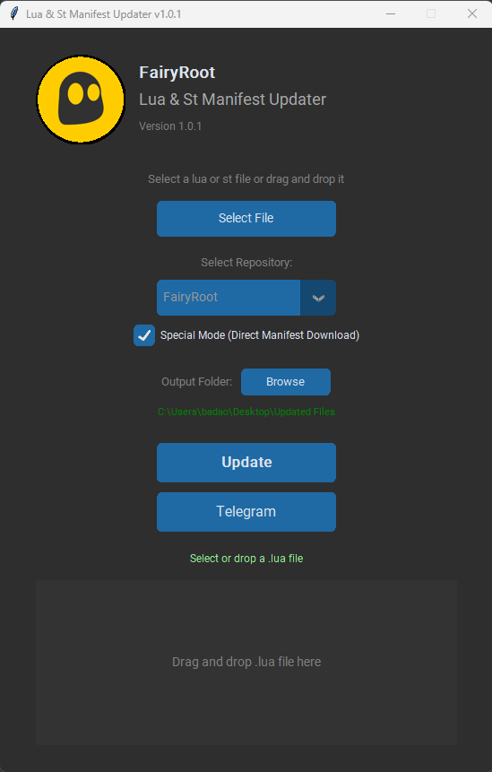

# Lua & St Manifest Updater (LSMU)

<div align="center">
  
</div>

**Lua and St Manifest Updater (LSMU)** is a feature-rich tool for update Lua or St files with the latest manifest IDs for Steam games.

<div align="center">
  
</div>

## Features

*   **File Input:** Select `.lua` or `.st` files via a file dialog or drag-and-drop.
*   **Game ID Extraction:** Automatically extracts the Steam Game ID from the selected `.lua` file.
*   **Steam Game Info:** Fetches and displays the game's capsule image and description from the Steam store widget based on the extracted Game ID. Includes a retry option on fetch errors.
*   **Manifest Download:** Downloads the latest manifest archive (`.zip`) for the specific game ID (with a proxy fallback).
*   **Manifest Extraction:** Extracts `.manifest` files from the downloaded archive.
*   **Lua File Update:** Updates the manifest IDs within the provided `.lua` or `.st` file using the information from the extracted manifests.
*   **Output Generation:** Creates a new `.zip` archive containing the updated `.lua` or `.st` file (renamed to `<game_id>.lua`) and the relevant `.manifest` files.
*   **Custom Output:** Allows specifying a custom output directory (defaults to `Updated Files` on the Desktop).
*   **User-Friendly Interface:** Provides clear status updates and error messages throughout the process via GUI.
*   **Error Handling:** Manages potential issues like invalid file types, network errors during download, problems during extraction, or missing Game IDs.

---

## Installation

### Clone the Repository

```bash
git clone https://github.com/fairy-root/lua-st-manifest-updater.git
cd lua-st-manifest-updater
```

### Prerequisites

1. Install Python 3.8 or higher.
2. Install the required dependencies:

   ```bash
   pip install -r requirements.txt
   ```
---

## Usage

**Run the Tool**:

   ```bash
   python app.py
   ```

---

## Notes

USE a **VPN** if the download is failing.

---

## Donation

Your support is appreciated:

- **USDt (TRC20)**: `TGCVbSSJbwL5nyXqMuKY839LJ5q5ygn2uS`
- **BTC**: `13GS1ixn2uQAmFQkte6qA5p1MQtMXre6MT`
- **ETH (ERC20)**: `0xdbc7a7dafbb333773a5866ccf7a74da15ee654cc`
- **LTC**: `Ldb6SDxUMEdYQQfRhSA3zi4dCUtfUdsPou`

## Author

- **GitHub**: [FairyRoot](https://github.com/fairy-root)
- **Telegram**: [@FairyRoot](https://t.me/FairyRoot)

## Contributing

If you would like to contribute to this project, feel free to fork the repository and submit pull requests. Ensure that your code follows the existing structure, and test it thoroughly.

## License

This project is licensed under the MIT License - see the [LICENSE](LICENSE) file for details.

---
